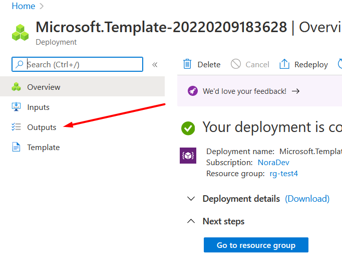

# Initial Azure deployment 

Please specify resources location and create a new resource group.
This temlate will create
* Resource Group
* API Connection. Connection between Event Grid Topic and Logic app.
* Event Grid Topic.
* Logic app with subscribtion on **queues.conversations.emails** with initial steps. 
* Managed Identity. Secure access between Logic app and API Connection.

After deployment go to Outputs and copy EventGrid Endpoint, EventGrid Secret to https://eventgrid.repo361.com/

List of [samples](https://github.com/Noralogix/genesyscloud-eventgrid/tree/main/samples)
